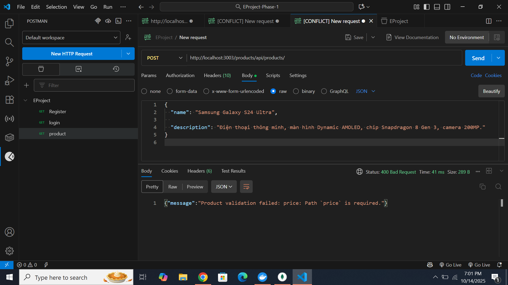

Download source code
Run npm install
Setup all microservices
Test all business logic with POSTMAN

- REGISTER : 

-REGISTER THIEU USERNAME HOAC PASSWORD 

-LOGIN 

- LOGIN SAI USERNAME HOAC PASSWORD 

- CREATE PRODUCT 

- CREATE PRODUCT THIEU 1 THUOC TINH 

- GET PRODUCT LAY RA DANH SACH 

- ORDER PRODUCT 

- docker-compose up --build

-docker ps

- MONGO IN DOCKER  
docker exec -it mymongodb bash

[def]: Public/img2.PNG
